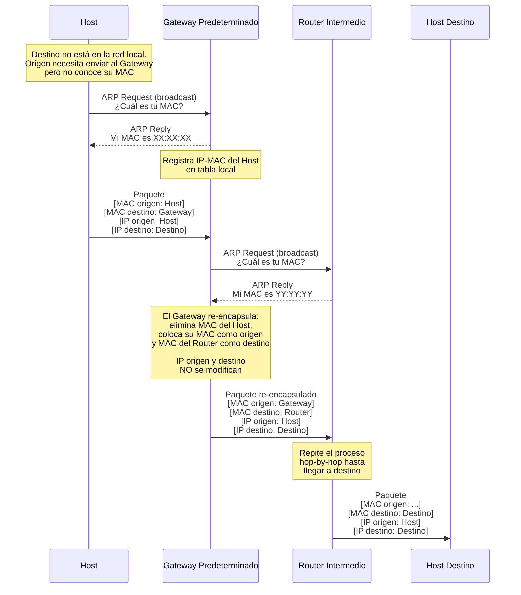

# Trabajo Práctico N1

## Nombres

- Nicolas Piñera
- Julian Krede
- Federico Arnaudo
- Franco Perotti

**Nombre del Grupo**: Puerto1337

## UNC - Facultad de Ciencias Exactas, Físicas y Naturales

## Cátedra: Redes de Computadoras

### Profesores

- Henn, Santiago Martin
- Oliva Cuneo, Facundo

**Fecha**: 12/03/2026

---

## Información de los autores

- **Información de contacto**:
  - [nicolas.pinera@mi.unc.edu.ar](mailto:nicolas.pinera@mi.unc.edu.ar)
  - [julian.krede@mi.unc.edu.ar](mailto:julian.krede@mi.unc.edu.ar)
  - [federico.arnaudo@mi.unc.edu.ar](mailto:federico.arnaudo@mi.unc.edu.ar)
  - [franco.perotti@mi.unc.edu.ar](mailto:franco.perotti@mi.unc.edu.ar)

---

## Resumen

Este documento detalla la simulación de una infraestructura de red WAN y el estudio de los sistemas de detección de errores en la **capa de enlace**. En la fase inicial, se modeló el intercambio de datos entre redes de área local (LAN), verificando el funcionamiento del protocolo **ARP** y el direccionamiento **hop-by-hop**. Asimismo, se examinó el encapsulamiento de datos, contrastando la naturaleza volátil de las tramas Ethernet respecto a la persistencia de los paquetes IP. Posteriormente, se implementaron métodos de **detección de errores (EDAC)**, tales como **CRC y paridad**, para garantizar la integridad de la información transmitida.

**Palabras clave**: _Ruteo Hop-by-Hop, IP, MAC, Encapsulamiento, EDAC, CRC, Paridad, LAN._

---

## Introducción

El presente informe documenta las actividades realizadas durante el laboratorio de la cátedra de Redes de Computadoras. La práctica se dividió en dos fases fundamentales para comprender el funcionamiento de las redes de datos: el ruteo a través de una infraestructura WAN simulada y el estudio de mecanismos de detección de errores en la capa de enlace. A través de una metodología práctica donde los estudiantes asumieron roles de hosts, gateways y routers, se analizaron conceptos críticos como el direccionamiento lógico (IP), el direccionamiento físico (MAC), el protocolo de resolución de direcciones (ARP) y el impacto del tiempo de vida (TTL) en la estabilidad de la red. Finalmente, se exploraron algoritmos de redundancia como paridad y XOR para verificar la integridad de la información transmitida frente a posibles interferencias.

---

## Resultado Primera Parte: Repaso general didáctico. Simulación de envío de paquetes, ARP y ruteo entre redes

Para empezar esta actividad, el aula se convirtió en una red heterogénea. Para ello, los diferentes grupos fueron adoptando roles: algunos representaron una LAN (Red de área local) y otros tomaron el rol de Routers Intermedios.

Dentro de las LAN, uno de los integrantes del grupo toma el rol de Gateway predeterminado de los otros 3 hosts que forman la LAN. El Gateway predeterminado se encarga de ser la puerta de salida de los paquetes que se desean enviar a hosts fuera de la LAN. Por otro lado, los Routers intermedios se encargan de reenviar los paquetes a los gateways predeterminados correspondientes a las LAN de destino. A continuación se presenta un diagrama de la distribución utilizada donde se puede ver claramente que cada LAN representa una **topología estrella** en la que todos los hosts se conectan a su gateway predeterminado.

Una vez entendida la distribución de roles por grupo, nos tocó definir los roles de cada integrante dentro de la red LAN. Los hosts tienen un **prefijo de red**, una **IP de host**, **IP de host de destino**, dirección física o **MAC** y una carga o **Payload** que deberían enviar en binario. Además, para los paquetes se estableció un TTL (Time to Live) de 6. Este valor se decrementa cada vez que el paquete realiza un salto entre dispositivos. Si el parámetro de TTL llega a _0_, el paquete se _descarta_. Con estos datos se completaron las **NIC** de cada integrante. A continuación se presenta una tabla con los datos y roles asignados a cada uno.

> [!NOTE]
> TODO: MAC del Gateway Predeterminado

| Nombre   | Tipo de Dispositivo    | Prefijo de red   | IP            | IP destino    | MAC        | Payload    | TTL   |
| -------- | ---------------------- | ---------------- | ------------- | ------------- | ---------- | ---------- | ----- |
| Julian   | Gateway Predeterminado | `10.14.0.0/24`   | `10.14.0.1`   | `variable`    |            | `variable` | `N/A` |
| Nicolas  | Host                   | `10.14.0.0/24`   | `10.14.0.104` | `10.13.0.101` | `AD:44:54` | `355b`     | `6`   |
| Franco   | Host                   | `10.14.0.0/24`   | `10.14.0.103` | `10.3.0.102`  | `AC:42:76` | `436e`     | `6`   |
| Federico | Host                   | `10.14.0.0/24`   | `10.14.0.102` | `10.7.0.102`  | `AC:40:87` | `91C2`     | `6`   |

> [!NOTE]
> En el caso del Gateway Predeterminado, la IP de destino y el payload no son fijos, ya que dependen del paquete que se esté reenviando.

Para realizar el envío de un paquete desde un host a otro ubicado en diferentes LAN se tienen que seguir los siguientes pasos:

- El host debe consultar al Gateway Predeterminado su dirección MAC. Una vez entregada, el host agrega esta dirección a la cabecera del paquete a enviar.
- El Gateway predeterminado debe armar una tabla en la cual registra las direcciones IP de la red local junto con su dirección MAC.
- Una vez que el Gateway predeterminado recibió el paquete, le consulta al router intermedio su dirección MAC. Una vez conocida, modifica el paquete original: elimina la dirección MAC del primer host, coloca su propia dirección MAC como origen y la del router intermedio como destino. En todo este proceso, el gateway nunca modifica las direcciones IP de origen o destino.
- El router intermedio forma una tabla con información de cada router intermedio y las redes que están a su alcance, para saber a quién reenviar ese paquete.
- Por otro lado, el proceso de preguntar la dirección MAC al próximo dispositivo y completar esta información en el paquete sigue hasta que el mismo llegue a destino.

El proceso en el cual un dispositivo consulta a otro su dirección MAC se llama **Protocolo de Resolución de direcciones (ARP)**. Este es un protocolo de la capa de enlace de datos, que se encarga de vincular una dirección de red (IP) con una dirección física (MAC).

El mismo consiste en que el dispositivo que quiere enviar un paquete realiza una **ARP Request** por **broadcast (difusión)** a todos los dispositivos de la red local. El dispositivo cuya dirección IP coincide con la solicitada responde con su dirección MAC.

La IP es **extremo a extremo (end-to-end)** y por eso no cambia nunca durante todo el viaje. En cambio, la MAC es **salto a salto (hop-by-hop)**, lo que quiere decir que va a ir cambiando a medida que el paquete se traslada por la red, porque el router se encarga de "encaminarlo" por diferentes nodos.

A continuación se presenta un diagrama de secuencia que ilustra el proceso de envío de un paquete desde un host a otro ubicado en diferentes LAN, pasando por un Gateway predeterminado y un Router intermedio:

> [!NOTE]
> A nuestro grupo no le llegó ningún paquete en esta actividad

Cuando un host quiere enviar un paquete a un dispositivo en otra red, no intenta descubrir directamente la MAC del host destino, sino la del gateway predeterminado, ya que un host solo tiene visibilidad directa de los dispositivos en su propia red local (LAN). Esto es importante por las siguientes razones:

- Limitación del alcance del Broadcast (ARP).
- Desconocimiento de la topología externa.
- Diferencia entre direccionamiento físico y lógico.

El gateway actúa como un intermediario. El host solo necesita saber si la IP de destino no está en su red, en ese caso se la entrega al Gateway predeterminado. Sin el gateway, cada host del mundo tendría que mantener una tabla de rutas de toda la Internet para saber exactamente a qué siguiente nodo físico enviarle el paquete.

El modelo de ruteo hop-by-hop (salto a salto) es el pilar que permite la escalabilidad de redes globales como Internet. En este esquema, cada router toma decisiones de envío de manera local, basándose exclusivamente en su propia tabla de ruteo y no en el conocimiento del camino completo hacia el destino. Esto presenta las siguientes ventajas:

- **Escalabilidad y Eficiencia de Memoria**: Los dispositivos no necesitan almacenar rutas hacia cada host individual del mundo; solo requieren conocer el "siguiente salto" (next hop) para alcanzar una red de destino.
- **Aislamiento de la Topología:** Un host emisor no necesita conocer la infraestructura interna de redes remotas. Solo debe identificar, mediante su máscara de subred, si el destino es externo para entregar el paquete a su Gateway por defecto.
- **Desacoplamiento de Capas**: Este modelo permite que el direccionamiento lógico (IP) permanezca constante de extremo a extremo, mientras que el direccionamiento físico (MAC) se adapta dinámicamente en cada enlace mediante el proceso de re-encapsulamiento.

Es necesario reconstruir el frame Ethernet en cada salto ya que los frames son propios de cada enlace, es decir, un router debe tomar el frame recibido y adaptarlo para el siguiente tramo de la red. Esto es así, debido a que las direcciones MAC cambian en cada salto, hacia el dispositivo al que va dirigido.
Si el router intenta reenviar el mismo frame, éste tendrá direcciones MAC erróneas/incorrectas que no coinciden con ningún nodo. En ese caso, el siguiente salto descartaría el frame y el dato nunca llegaría a destino.
Si bien el paquete no sufriría cambios, al no contar con un frame adecuado, este quedaría sin ser entregado.

El campo TTL (Time to Live) funciona como un mecanismo de seguridad vital que previene la persistencia indefinida de paquetes en la red, evitando principalmente los bucles de ruteo (routing loops). Si por un error en las tablas de ruteo dos routers se reenviaran un paquete entre sí de forma cíclica, el TTL garantiza que el paquete sea descartado una vez que el contador llegue a cero, liberando así los recursos de la red.

Sin la existencia del TTL, un paquete atrapado en un bucle circularía infinitamente a través de los enlaces, consumiendo ancho de banda y capacidad de procesamiento de manera acumulativa. En una red de gran escala como Internet, esto provocaría rápidamente una congestión masiva o una tormenta de difusión, saturando los nodos y provocando la caída de los servicios al no haber una "fecha de caducidad" física para la información que no logra encontrar su destino.

## Resultado Segunda Parte: Inyección y detección de errores

En la segunda parte del laboratorio, se trabajó sobre la integridad de los datos. La red puede sufrir de ruido e interferencia, los cuales pueden provocar un error en los datos que se envían. Para esto, se aplican técnicas de **EDAC (Error Detection and Correction)**, las cuales son un conjunto de algoritmos aplicados en la transmisión de datos para garantizar que la información recibida sea idéntica a la enviada. Dentro de las técnicas de EDAC consultadas, se encuentran: **Checksum, CRC y Paridad**.

En el caso de CRC (Código de Redundancia Cíclica), se nos presentó la técnica del **XOR**, la cual consiste en tomar los dos nibbles más significativos, realizar la operación XOR bit a bit y, con el resultado, repetir la operación con el siguiente nibble hasta procesar todos los datos de nuestra carga. Por último, se dispone de un nibble para establecer el código de EDAC obtenido.

En el caso de la técnica de **Paridad**, se cuentan todos los **1** presentes en nuestra carga. Si hay una cantidad _par_ de unos, se agrega un _0_ al final; de lo contrario, se agrega un _1_.

A nuestro grupo le tocó enviar paquetes con el algoritmo de **Paridad** y recibir paquetes con código generado con el algoritmo **XOR**. Como se mencionó anteriormente, estos algoritmos agregan metadatos al paquete para corroborar si hay errores al momento de la recepción. Enviamos paquetes con una **carga** (payload) y un código de **EDAC**. Al recibir una trama (frame), debemos verificar dicho código para detectar errores.

Las tramas tienen la siguiente información:

- **IP de origen**: _10.14.0.1_
- **IP de destino**: _x_
- **Payload**: _D23Ch (1101001000111100b)_
- **EDAC**: Por paridad, el código de EDAC es _0_.

En el reporte de **recepción**, registramos lo siguiente:

- **IP de origen**: 10.1.11
- **Payload recibido**: _F501_
- **EDAC para el payload recibido**: _1011_ o _B_
- **EDAC**: _F_ o _1111_
- **Algoritmo utilizado**: El código de EDAC fue el CRC calculado por _XOR_.
- **El payload está íntegro**: El payload _no_ está íntegro, ya que existe una diferencia entre el valor de EDAC calculado (1011) y el valor establecido en la trama (1111).
- **Potenciales payloads**:
  - **Modificando un bit**: B501 - F101 - F541 - F505
  - **Modificando dos bits**: B541 - F105 - B505
  - **Modificando tres bits**: F145 - B545

---

## Conclusiones

La realización de esta práctica permitió consolidar la distinción entre el direccionamiento de extremo a extremo y el de salto a salto. Se comprendió que la persistencia de la dirección IP es lo que permite que un paquete mantenga su destino global, mientras que la variabilidad de la dirección MAC es la que posibilita su desplazamiento físico a través de diferentes redes locales. Asimismo, la implementación del rol de Gateway puso de manifiesto la importancia de los puntos de salida predeterminados para la interconexión de redes heterogéneas, donde el protocolo ARP actúa como el puente necesario entre las capas de red y de enlace.

Por otro lado, la sección dedicada a EDAC demostró que la transmisión de datos es inherentemente susceptible a errores. La comparación entre métodos simples como la paridad y algoritmos más robustos como el CRC (XOR) evidenció que, aunque la redundancia añade carga extra al envío (metadata), es un sacrificio necesario para garantizar una comunicación confiable. En conclusión, la práctica integró exitosamente los conceptos teóricos del modelo OSI con una experiencia práctica de simulación, proporcionando una visión integral de cómo se estructuran y protegen los datos en un entorno de red real.

---
